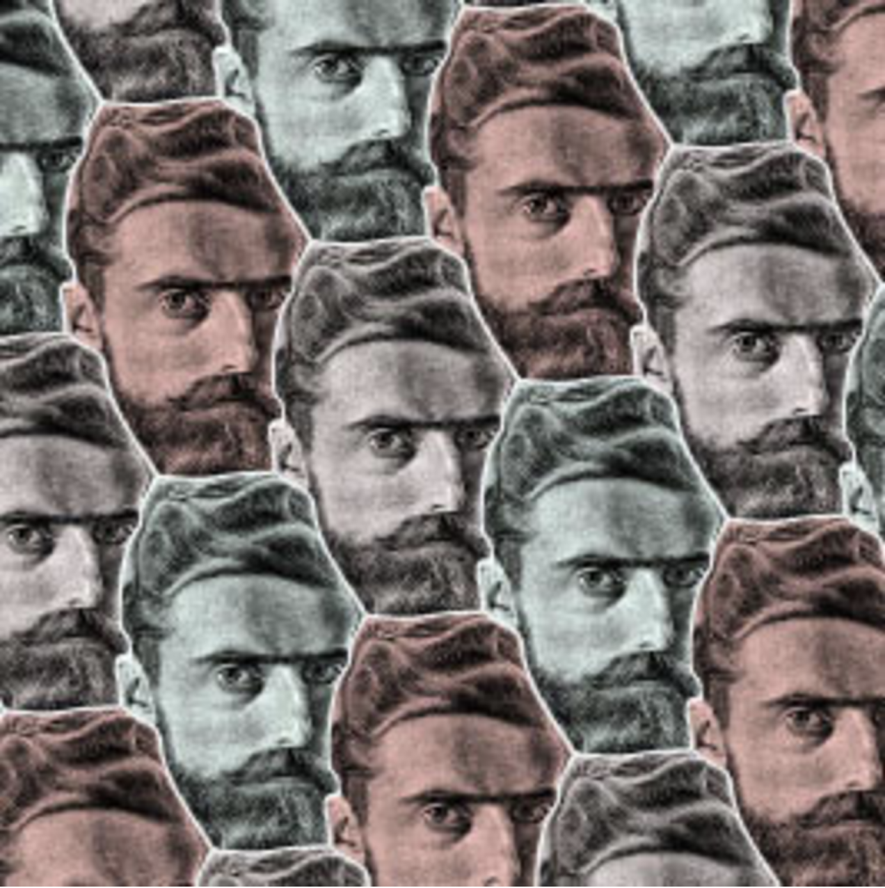
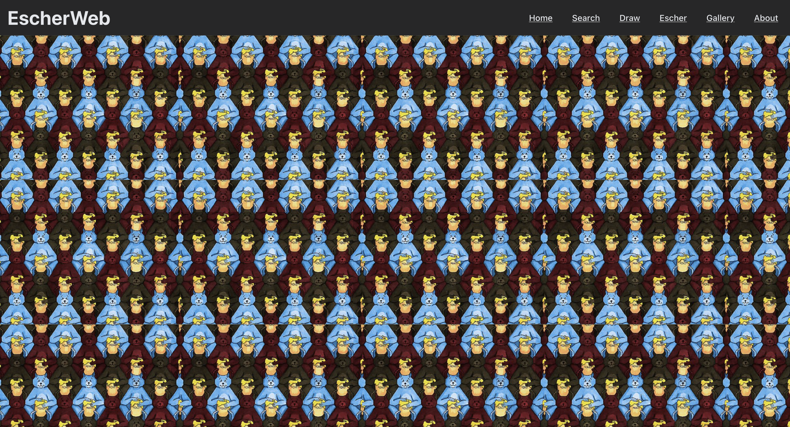
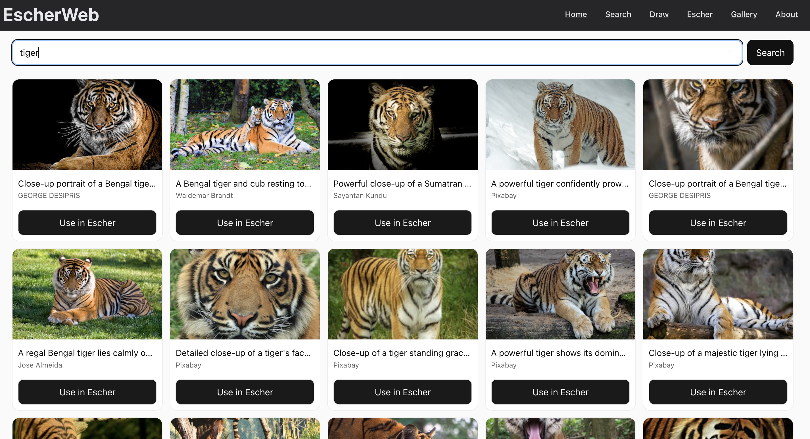
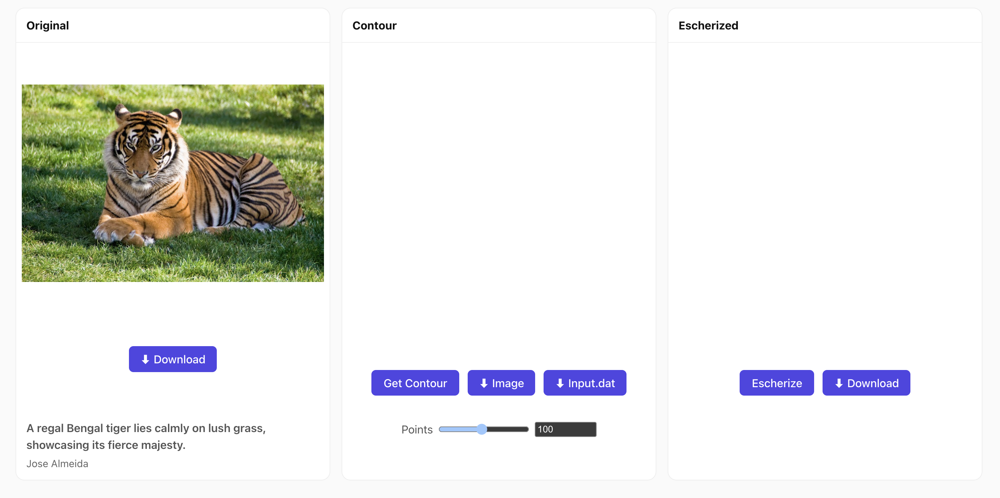
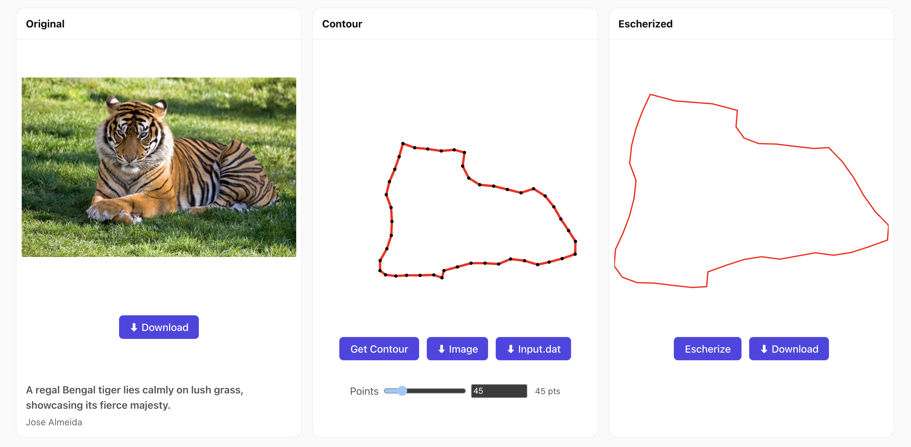
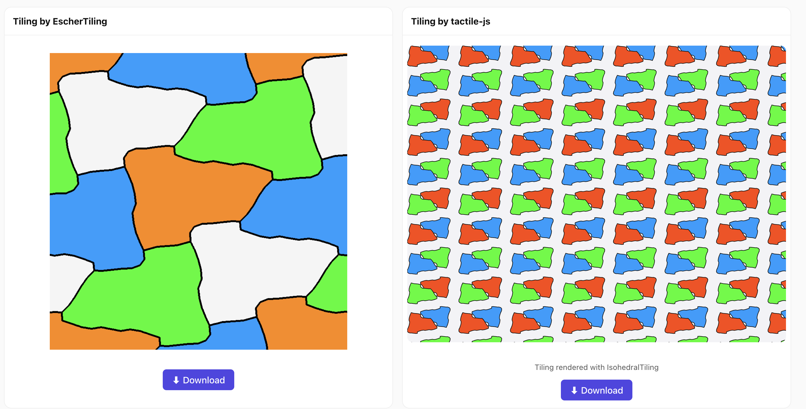

# Escher Web

Final project for **CS898 – Tiling and Computation**, University of Waterloo.

Escher Web is a **React-based interactive web tool** for transforming user-supplied shapes into *mathematically valid tileable forms*. Users can **draw**, **search**, or **upload** a shape, which is then processed by an **Escherization algorithm** to produce a similar but tilable shape. The result is displayed in a plane tiling generated via the [`tactile-js`](https://github.com/isohedral/tactile-js) library and the backend of the [`EscherTiling`](https://github.com/nagata-yuichi/EscherTiling) algorithm.

## Features
- **Draw Mode** – Create shapes directly in the browser.
- **Search Mode** – Lookup shapes from a pre-defined gallery.
- **Upload Mode** – Upload custom shapes for processing.
- **OpenCV.js Integration** – For contour extraction and preprocessing.
- **Escherization Algorithm** – Computes a tilable variant of the shape outline.
- **Live Tiling Preview** – Uses `tactile-js` or `EscherTiling` to fill the plane with the computed tile.

## Project Structure

The project has the following structure:

```text
.
├── README.md
├── eslint.config.js
├── index.html
├── package-lock.json
├── package.json
├── public
│   ├── icon.png
│   ├── jikken_E.wasm
│   └── jikken_E.wasm.map
├── src
│   ├── App.jsx
│   ├── components
│   │   ├── NavBar.jsx
│   │   └── jikken_E.js
│   ├── css
│   │   ├── About.css
│   │   ├── App.css
│   │   ├── Draw.css
│   │   ├── Escher.css
│   │   ├── Home.css
│   │   ├── Navbar.css
│   │   ├── Search.css
│   │   └── index.css
│   ├── main.jsx
│   ├── pages
│   │   ├── About.jsx
│   │   ├── Draw.jsx
│   │   ├── Escher.jsx
│   │   ├── Gallery.jsx
│   │   ├── Home.jsx
│   │   └── Search.jsx
│   ├── utils
│   │   ├── api.js
│   │   ├── opencv.js
│   │   └── selection.js
│   └── wallpapers
│       ├── img1.png
│       ├── img2.png
│       ├── img3.png
│       ├── img4.png
│       ├── img5.png
│       ├── img6.png
│       └── img7.png
└── vite.config.js

8 directories, 37 files
```

## Installation & Setup
This project uses **Node.js** and **Vite**.

1. **Clone the repository**

```bash
git clone https://github.com/mehrad31415/EscherWeb.git
cd EscherWeb/
```

2. **Install Dependencies**

```bash
npm install
```

3. **Run in Development Mode**

```bash
npm run dev
```

The app will be available at `http://localhost:5174/` by default.

## User Interface

- The _favicon_ of the website looks like the following:



This image was taken from Kaplan, C. S., & Salesin, D. H. (2000, July). Escherization. In Proceedings of the 27th annual conference on Computer graphics and interactive techniques (pp. 499-510).

- The _homepage_ of the website looks like the following:



Under the `src/wallpapers/` directory there are seven different wallpapers where each time the _homepage_ is reloaded one is randomly chosen as the wallpaper. These images were taken from `https://tiled.art/en/home/`.

- The navigation bar includes _Home_, _Search_, _Draw_, _Escher_, _Gallery_, and _About_. The _About_ page provides a biref overview about the project and acknowledgements. The _Search_ provides an interface to lookup an image of the users choice. In the backend, Unsplash, Pexels, and Pixabay APIs are used to retrieve images. This functionality is rate-limited, and frequent requests may result in temporary unavailability. One choosing the image, there is a button `Use in Escher` which leads to the _Escher_ home page. Likewise, in the _Draw_ page there is a canvas where the user can draw their own shape and upon clicking on `Use in Escher` they will be redirected to the `Escher` page. Alternatively, the user can directly go to the _Escher_ page from the navigation bar and upload their image of choice in `png/jpg` format.



- The _Escher_ page looks like the following:



You can download the original image itself by clicking the download button and a reference of the image can be seen on the page. The user must choose the number of points for the contour. For performance reasons, please select a maximum of 50 points (even though the web app technically supports up to 200, in steps of 5) to avoid potential crashes. Click on `Get Contour` and wait for the process of removing backend and getting the outline of the image to be completed. You can download this image and the data points of the image if you desire. Upon generating the contour, by clicking on `Escherize`, the escherization algorithm will start running. Upon completion we will get the tilable shape which is close to the original contour, and receive the tiling of the image like following:



The following tilings are generated automatically. The left tiling is produced by the EscherTiling software (with some changes, since it originally used X11 for display), and the right tiling is generated using tactile-js.



Note that in the right hand side, the repeating motif is a single shape that is repeated across the plane with only rigid motions, with some fixed background shapes.

- Finally, the Gallery showcases example runs using polygons from the EscherTiling repository. Thus, this project serves two purposes: (1) generating escherizations and tilings for random images, and (2) hosting an online gallery of the polygons from the EscherTiling project.